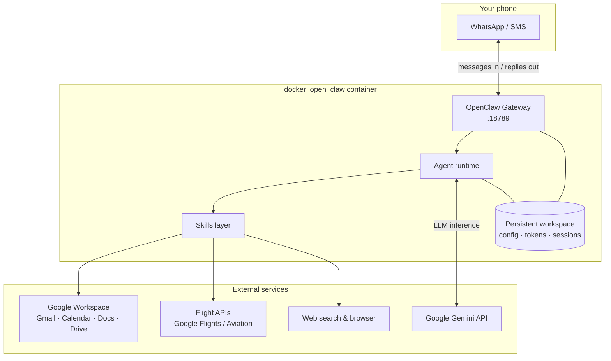
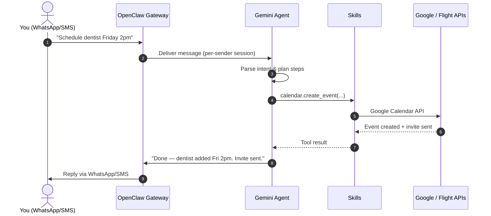
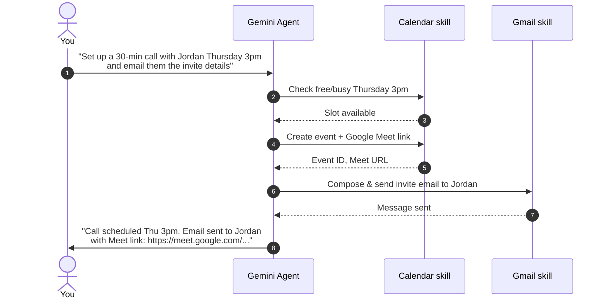
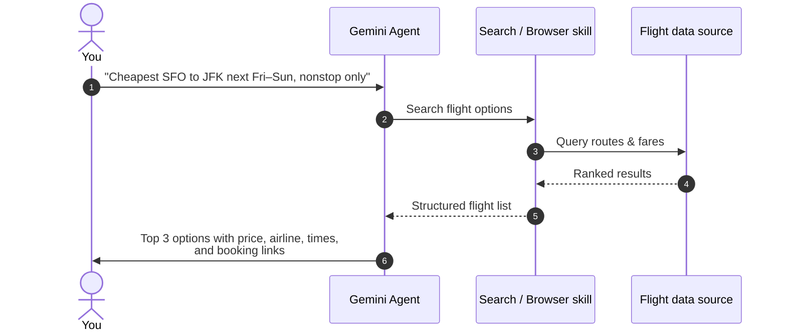
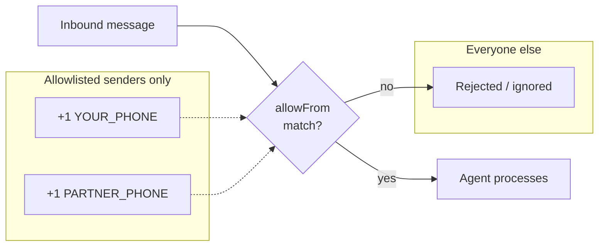
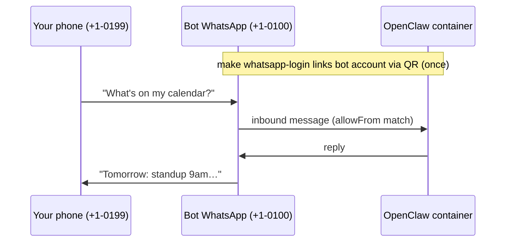
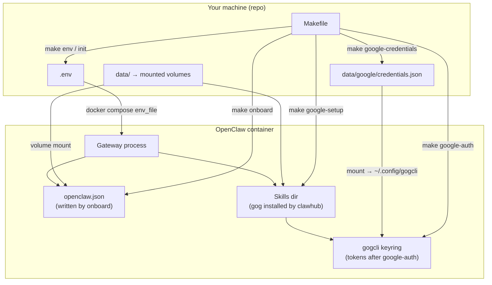
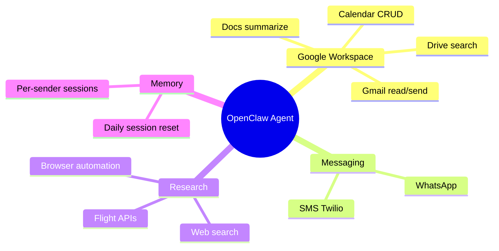
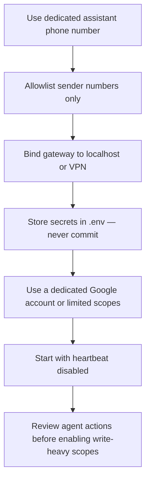

# docker_open_claw

A Dockerized [OpenClaw](https://github.com/openclaw/openclaw) personal assistant powered by **Google Gemini**, reachable over **WhatsApp** or **SMS**. Message the bot from your phone to manage Google Workspace (Gmail, Calendar, Docs), research flights, and run general research tasks — all through natural-language chat.

> **Status:** Runnable Docker wrapper around upstream OpenClaw. The Makefile orchestrates first-run setup; OpenClaw itself owns config, skills, and OAuth. See [How setup works](#how-setup-works) and [TODO.md](TODO.md) for remaining gaps.

---

## What it does

| Capability | Example message |
|---|---|
| **Schedule meetings** | "Schedule lunch with Alex next Tuesday at noon and send him a calendar invite." |
| **Email & invites** | "Email the team about Friday's standup and CC Sarah." |
| **Calendar lookup** | "What's on my calendar tomorrow morning?" |
| **Flight research** | "Find the cheapest nonstop SFO → JFK flights next weekend." |
| **General research** | "Summarize the latest news on quantum computing." |
| **Docs & Drive** | "Find the Q4 budget doc in Drive and summarize the key numbers." |

The assistant runs 24/7 inside a container. You talk to it through a messaging channel; it reasons with Gemini and calls Google APIs (and other tools) on your behalf.

---

## Architecture overview



### Component roles

| Component | Role |
|---|---|
| **OpenClaw Gateway** | Receives inbound WhatsApp/SMS messages, routes them to the agent, and sends replies back. |
| **Agent (Gemini)** | Interprets intent, plans multi-step actions, and selects the right skills. |
| **Skills** | Concrete integrations — Gmail send, Calendar create, flight search, web browse, etc. |
| **Persistent workspace** | Stores `openclaw.json`, OAuth tokens, WhatsApp session, and conversation history across restarts. |

---

## Communication flows

### Inbound message → action → reply



### Multi-step workflow (email + calendar)



### Flight research flow



### Session & security boundary



Only phone numbers listed in `channels.whatsapp.allowFrom` can command the agent. The bot should use its **own WhatsApp number**; your personal number goes in the allowlist. See [WhatsApp setup](#whatsapp-setup).

---

## Prerequisites

- **Docker** and **Docker Compose** (Docker Desktop on Windows/macOS, or native Docker on Linux)
- **Google Gemini API key** — [Google AI Studio](https://aistudio.google.com/apikey)
- **Google Cloud project** with OAuth credentials for Workspace APIs (Gmail, Calendar, Drive, Docs)
- **Dedicated bot Gmail** for Google Workspace — **not** your personal account ([why?](docs/google-workspace.md))
- **WhatsApp** — see [WhatsApp setup](#whatsapp-setup) below (not a second daily phone; you need a **second WhatsApp number** for the bot identity)
- **Optional:** [Flight search](docs/flights.md) via `make flights-setup` (no API key); paid APIs later if needed

---

## WhatsApp setup

OpenClaw talks to WhatsApp the same way **WhatsApp Web** does: it links as a “linked device” to a WhatsApp **account**. The QR step in `make whatsapp-login` is that link — scan it with the phone that is logged into **the account you want the bot to use**.

There is no special “assistant phone” hardware. What you need is two **roles**, which can overlap depending on your setup:

| Role | What it is | Example |
|---|---|---|
| **Bot identity** | The WhatsApp *account* OpenClaw logs in as — this number receives commands and sends replies | `+1-555-0100` |
| **Your phone** | The number in `WHATSAPP_ALLOW_FROM` — the only number allowed to *command* the bot | `+1-555-0199` (your personal mobile) |

**Typical flow (recommended):** you text the **bot number** from **your personal phone**. The bot never needs to touch your personal WhatsApp account.



### Do I need a second physical phone?

**No.** You need a **second phone number** registered with WhatsApp for the bot — not a second device you carry every day.

Ways people do that:

| Approach | Notes |
|---|---|
| **Prepaid SIM / eSIM** (~$5–10/mo) | Register WhatsApp once on any phone, run `make whatsapp-login`, then the SIM can live in a drawer. Session persists in `data/`. |
| **WhatsApp second account** (same phone) | Many phones support two WhatsApp accounts if you have a second number (eSIM, work line, etc.). |
| **Old phone on Wi‑Fi** | Register the bot number once, scan QR, stash the phone — only needed again if the session breaks. |
| **Link your personal WhatsApp** | Technically works — scan QR on your daily phone. **Not recommended:** the bot sends messages *as you* to all your contacts. See security section. |

### What `make whatsapp-login` actually does

1. OpenClaw prints a QR code in the terminal.
2. On the phone logged into the **bot’s** WhatsApp account: **Settings → Linked devices → Link a device** → scan.
3. Session is saved under `data/` — you don’t keep scanning unless it expires.

Set `WHATSAPP_ALLOW_FROM` in `.env` to **your** personal number (E.164, e.g. `+15551234567`), then `make sync-config`.

### Don’t have a second number?

- **Telegram** is the usual alternative — bot token, no extra SIM. OpenClaw supports it natively (`openclaw channels add --channel telegram`).
- **SMS/Twilio** is on the [roadmap](TODO.md) for this repo.

---

## Quick start

```bash
git clone https://github.com/YOUR_ORG/docker_open_claw.git
cd docker_open_claw

make init                     # .env + data/ directories
# Edit .env — at minimum: GEMINI_API_KEY, WHATSAPP_ALLOW_FROM

make build
make onboard                  # one-time: writes data/openclaw.json
make up
make logs                     # wait for healthy gateway

make whatsapp-login           # link bot WhatsApp account (scan QR — see WhatsApp setup)
# Control UI: http://127.0.0.1:18789 — paste OPENCLAW_GATEWAY_TOKEN from .env
```

**Google Workspace** (optional, recommended): [docs/google-workspace.md](docs/google-workspace.md)

```bash
make google-credentials SRC=/path/to/client_secret.json
# Set GOG_ACCOUNT + GOG_KEYRING_PASSWORD in .env, then:
make restart
make google-setup             # install gog skill
make google-auth              # OAuth — sign in as the bot Gmail
make google-status
```

**Flights** (optional, no API key): [docs/flights.md](docs/flights.md)

```bash
make flights-setup            # Google Flights search via flights-search skill
```

Run `make help` for all commands.

---

## How setup works

The Makefile does **not** generate a full config from `.env` automatically. It is a thin orchestration layer: copy files on the host, mount volumes into the container, and run OpenClaw / gog CLIs inside Docker. OpenClaw does the real work.



### What each step actually does

| Step | What happens | Who reads it |
|---|---|---|
| **`make env`** | Copies `.env.example` → `.env` on the host | Docker Compose injects vars into the container process |
| **`make onboard`** | Runs `openclaw onboard` once; writes **`data/openclaw.json`** (Gemini key, gateway mode, model) | OpenClaw gateway at startup (`~/.openclaw/openclaw.json` via mount) |
| **`make sync-config`** | Merges `.env` into **`data/openclaw.json`** (WhatsApp allowlist, model, timezone) | OpenClaw gateway at startup |
| **`make up`** | Starts `node dist/index.js gateway` | Loads `openclaw.json`, starts agent + channel plugins |
| **`make whatsapp-login`** | Runs OpenClaw channel login; stores WhatsApp Web session under `data/` | OpenClaw WhatsApp plugin |
| **`make google-credentials`** | Copies Google OAuth **client** JSON → `data/google/credentials.json` | `gog` CLI (`gog auth credentials …`) |
| **`make google-setup`** | Runs `clawhub install gog` inside the container | Installs the **gog skill** into OpenClaw's skills directory |
| **`make google-auth`** | Runs `gog auth add` — browser OAuth for **`GOG_ACCOUNT`** | Stores **refresh tokens** in `data/google/` (gogcli keyring) |

**So does OpenClaw "just find the JSON"?** Partially — there are **three different things**, not one magic file:

1. **`openclaw.json`** — main app config. Created by **`make onboard`**, not by dropping a file in the repo. Lives in `data/` after first run.
2. **`credentials.json`** — Google OAuth *client* ID/secret from Cloud Console. You copy it with **`make google-credentials`**. Used by the `gog` tool, not read directly by the gateway.
3. **gog tokens / keyring** — created by **`make google-auth`** after you approve OAuth in a browser. The **gog skill** uses these to call Gmail/Calendar APIs.

OpenClaw discovers installed skills (like `gog`) from its skills directory and exposes them to the agent when authenticated. No custom code in this repo — we mount the right folders and run the upstream CLIs.

### Config sync (`.env` → `openclaw.json`)

Selected `.env` values are merged into **`data/openclaw.json`** by `make sync-config`:

| `.env` variable | `openclaw.json` path |
|---|---|
| `WHATSAPP_ALLOW_FROM` | `channels.whatsapp.allowFrom` (comma-separated → array) |
| `WHATSAPP_ENABLED` | `channels.whatsapp.enabled` |
| `OPENCLAW_MODEL` | `agents.defaults.model.primary` |
| `TZ` | `agents.defaults.timezone` |

Runs automatically after **`make onboard`** and before **`make up`**. Re-run after editing `.env`:

```bash
make sync-config
make restart
```

---

## Environment variables

Configuration is supplied via a `.env` file at the project root. The container reads these values at startup.

### Core

| Variable | Required | Description |
|---|---|---|
| `GEMINI_API_KEY` | Yes | Google Gemini API key |
| `OPENCLAW_MODEL` | No | Primary model, e.g. `google/gemini-2.5-pro` |
| `OPENCLAW_GATEWAY_PORT` | No | Gateway listen port (default: `18789`) |
| `OPENCLAW_GATEWAY_TOKEN` | No | Machine auth token for the gateway UI/API |
| `OPENCLAW_GATEWAY_PASSWORD` | No | Human-friendly gateway password |

### Messaging — WhatsApp

| Variable | Required | Description |
|---|---|---|
| `WHATSAPP_ALLOW_FROM` | Yes | Comma-separated E.164 numbers — synced to `openclaw.json` via `make sync-config` |
| `WHATSAPP_ENABLED` | No | Enable WhatsApp channel (default: `true`) |

### Messaging — SMS (alternative)

| Variable | Required | Description |
|---|---|---|
| `SMS_PROVIDER` | No | Provider name, e.g. `twilio` |
| `TWILIO_ACCOUNT_SID` | If SMS | Twilio account SID |
| `TWILIO_AUTH_TOKEN` | If SMS | Twilio auth token |
| `TWILIO_PHONE_NUMBER` | If SMS | Twilio number the bot sends from |
| `SMS_ALLOW_FROM` | If SMS | Comma-separated numbers allowed to message the bot |

### Google Workspace (gog skill)

Use a **dedicated bot Gmail** — see [docs/google-workspace.md](docs/google-workspace.md).

| Variable | Required | Description |
|---|---|---|
| `GOG_ACCOUNT` | For Google | Bot Gmail address, e.g. `yourname-openclaw@gmail.com` |
| `GOG_KEYRING_PASSWORD` | For Google | Encrypts OAuth tokens in Docker (pick a long random string) |
| `GOG_KEYRING_BACKEND` | No | Default `file` — required for headless/container use |

Install OAuth client JSON with `make google-credentials SRC=/path/to/client_secret.json` (not via env vars). Optional legacy vars `GOOGLE_CLIENT_ID` / `GOOGLE_CLIENT_SECRET` are unused by the gog flow today.

**Google Cloud setup:** full walkthrough in [docs/google-workspace.md](docs/google-workspace.md).

### Flight research

Default: **`make flights-setup`** installs the [`flights-search`](docs/flights.md) skill (Google Flights–style data, **no API key**).

| Variable | Required | Description |
|---|---|---|
| `SEARCHAPI_KEY` | No | Paid upgrade — SearchAPI.io + `google-flights-search` skill |
| `FLIGHT_API_KEY` | No | Paid upgrade — Amadeus, Aviationstack, etc. |
| `FLIGHT_API_PROVIDER` | No | Provider identifier for paid API |
| `GOOGLE_CUSTOM_SEARCH_KEY` | No | Legacy fallback for web search |
| `GOOGLE_CUSTOM_SEARCH_CX` | No | Custom Search engine ID |

When no flight skill is installed, the agent can still use bundled web search / browser skills (less reliable for fares).

### Example `.env`

```env
# --- Gemini ---
GEMINI_API_KEY=AIza...
OPENCLAW_MODEL=google/gemini-2.5-pro

# --- Gateway ---
OPENCLAW_GATEWAY_PORT=18789
OPENCLAW_GATEWAY_PASSWORD=change-me

# --- WhatsApp ---
WHATSAPP_ALLOW_FROM=+15551234567

# --- Google (dedicated bot Gmail) ---
GOG_ACCOUNT=yourname-openclaw@gmail.com
GOG_KEYRING_PASSWORD=change-me

# --- Flights: make flights-setup (no key). Paid upgrades optional ---
```

---

## OpenClaw configuration (reference)

The gateway reads `openclaw.json` from the persistent data volume (`./data` → `/home/node/.openclaw`). **`make onboard` creates this file** on first run. Example shape after onboarding (WhatsApp allowlist may need manual edit):

```json5
{
  gateway: { mode: "local", port: 18789 },
  agents: {
    defaults: {
      model: { primary: "google/gemini-2.5-pro" },
      workspace: "/home/node/.openclaw/workspace",
      heartbeat: { every: "0m" },
    },
  },
  channels: {
    whatsapp: {
      allowFrom: ["+15551234567"],  // synced from WHATSAPP_ALLOW_FROM via make sync-config
    },
  },
}
```

Automatic `.env` → `openclaw.json` sync covers WhatsApp allowlist, model, and timezone — see [Config sync](#config-sync-env--openclawjson). Other settings still use the Control UI or manual edits.

---

## Skills & integrations



| Skill | Install | Purpose |
|---|---|---|
| `gog` | `make google-setup` | Gmail, Calendar, Drive, Docs via OAuth |
| `flights-search` | `make flights-setup` | Google Flights search — **no API key** |
| `web-search` | bundled / clawhub | General research |
| `browser` | bundled | Scrape pages, fallback |
| `google-flights-search` | clawhub (needs `SEARCHAPI_KEY`) | Paid structured Google Flights JSON |

---

## Example conversations

**Calendar**

> **You:** What's free tomorrow afternoon?  
> **Bot:** You're open 1–3 PM and after 4:30 PM. You have "Team sync" at 11 AM.

**Schedule + invite**

> **You:** Book a 45-min sync with morgan@example.com Friday at 10am, title "Sprint planning"  
> **Bot:** Created "Sprint planning" Fri 10:00–10:45 AM. Calendar invite sent to morgan@example.com.

**Email**

> **You:** Draft a reply to the last email from Acme Corp saying we'll review the proposal by EOD  
> **Bot:** Here's a draft: … Reply "send it" to dispatch, or tell me what to change.

**Flights**

> **You:** Nonstop LAX → ORD leaving June 28, returning July 2, under $400 if possible  
> **Bot:** Found 3 options: (1) United $347 dep 7:15 AM … (2) … Want me to open the booking link?

**Research**

> **You:** What are the visa requirements for US citizens visiting Japan for 2 weeks?  
> **Bot:** US citizens don't need a visa for tourism stays up to 90 days … [sources]

---

## Security



- **Never commit** `.env`, `credentials.json`, or OAuth token files.
- Add `.env` and `data/` to `.gitignore`.
- Restrict filesystem permissions on token files (`chmod 600`).
- Prefer a **dedicated Google account** for the agent rather than your primary inbox.
- Start with read-only Google scopes; enable send/write after you trust behavior.
- Keep `agents.defaults.heartbeat.every` at `"0m"` until proactive scheduling is desired.
- Run the gateway behind a firewall; expose port `18789` only on localhost or through an SSH tunnel.

---

## Project layout

```
docker_open_claw/
├── docker-compose.yml       # Service, volumes, env passthrough
├── Dockerfile               # Thin layer on ghcr.io/openclaw/openclaw
├── Makefile                 # Setup orchestration (make help)
├── scripts/
│   └── sync-config.js       # .env → openclaw.json merge
├── .env.example             # Template — copy via make env
├── docs/
│   ├── google-workspace.md  # Dedicated Gmail + OAuth guide
│   └── flights.md           # Flight search (flights-search skill)
├── config/google/           # Docs only; creds go in data/google/
└── data/                    # Gitignored runtime state (volume mounts)
    ├── openclaw.json        # Created by make onboard
    ├── workspace/
    └── google/
        ├── credentials.json # OAuth client (make google-credentials)
        └── keyring/         # Tokens after make google-auth
```

---

## Roadmap

See [TODO.md](TODO.md) for the living checklist. Summary:

- [x] Docker Compose + Makefile + `.env.example`
- [x] Gemini via `make onboard`
- [x] Google Workspace via gog skill + [docs/google-workspace.md](docs/google-workspace.md)
- [x] Health checks + persistent volumes
- [x] `.env` → `openclaw.json` sync (`make sync-config`)
- [x] Flight search via `flights-search` + [docs/flights.md](docs/flights.md)
- [ ] SMS / Twilio channel
- [ ] CI (compose validate, hadolint)

---

## Troubleshooting

| Symptom | Likely cause | Fix |
|---|---|---|
| QR code won't scan | Session expired or wrong phone | `make whatsapp-login` |
| "Unauthorized sender" | Number not in allowlist | Edit `channels.whatsapp.allowFrom` in `data/openclaw.json` |
| Missing credentials.json | OAuth client not installed | `make google-credentials SRC=…` |
| gog keyring prompt | Missing keyring password | Set `GOG_KEYRING_PASSWORD` in `.env`, `make restart` |
| Calendar empty | Calendar API not enabled | Enable in Cloud Console, `make google-auth` |
| Gmail auth wrong account | Signed in as personal Gmail | Re-auth as `GOG_ACCOUNT` — see [docs/google-workspace.md](docs/google-workspace.md) |
| Gemini errors | Invalid or quota-exceeded key | Check [AI Studio](https://aistudio.google.com/) quotas |
| Container restarts loop | Missing onboard or bad `.env` | `make onboard`, verify `.env` against `.env.example` |

---

## References

- [OpenClaw](https://github.com/openclaw/openclaw) — upstream project
- [OpenClaw docs — Personal assistant setup](https://docs.openclaw.ai/start/openclaw)
- [OpenClaw docs — Docker install](https://docs.openclaw.ai/install/docker)
- [Google AI Studio](https://aistudio.google.com/) — Gemini API keys
- [Google Workspace setup for this repo](docs/google-workspace.md)

---

## License

Apache License 2.0 — see [LICENSE](LICENSE).
