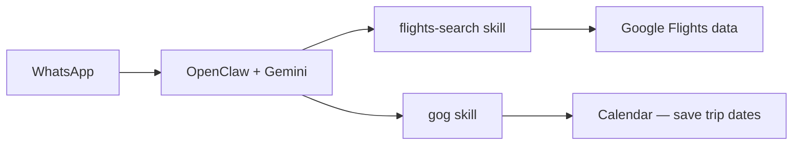

# Flight search

Ask the assistant on WhatsApp for things like *"nonstop SFO to JFK next Friday under $400"* and get ranked options with booking links.

This repo uses the OpenClaw **`flights-search`** skill — it queries **Google Flights–style data** via the community [`fast-flights`](https://github.com/ceod027/fast-flights) library. **No API key required** for basic search.

> **Not the same as a Google API.** Google shut down the official QPX Express Flights API in 2018. There is no supported `flights.googleapis.com` for agents. This skill uses the same data consumers see on Google Flights, through an unofficial client — it can break if Google changes their internals.

---

## How it fits the stack



- **Search & compare fares** → `flights-search`
- **Add trip to calendar** → `gog` (after [Google Workspace setup](google-workspace.md))
- **Live flight status** (“where is UA 123?”) → not covered by `flights-search`; use web search / browser or a paid aviation API later

---

## Why not bake it into the Dockerfile?

Skills install into **`~/.openclaw`**, which we mount from **`./data`** on the host. On first run, that empty mount **replaces** whatever was in the image — so a `RUN clawhub install` in the Dockerfile would be hidden and lost.

Install skills **after** the volume exists:

```bash
make up
make flights-setup
```

Same reason for `make google-setup` instead of baking `gog` into the image.

---

## Setup

Gateway must be running (`make up`).

```bash
make flights-setup
```

This runs `clawhub install flights-search` inside the container. The skill persists under `data/` across restarts.

### Test prompts (WhatsApp or Control UI)

- *"Find nonstop flights from SFO to JFK leaving June 28, returning July 2."*
- *"Cheapest economy LAX to London in August, any airline."*
- *"Morning departures NYC to Miami next Saturday, under $300 if possible."*

The skill understands **IATA codes** (SFO, JFK) and many **city names** (NYC, London, Tokyo) and can filter nonstop, cabin class, time windows, and passengers.

---

## What you get back

Typical output includes:

- Departure / arrival times
- Airline and flight numbers
- Duration and stops
- Price (when available)
- Link to open the itinerary on **Google Flights** for booking

Always verify price and availability on the airline or Google Flights before purchasing — scraped data can lag or differ.

---

## Limitations

| Topic | Reality |
|---|---|
| **Official Google API** | Does not exist for Flights |
| **Price accuracy** | Good for research; confirm before booking |
| **Breaking changes** | Google can change internal APIs; skill may need updates |
| **Live tracking** | Different feature — not this skill |
| **Price alerts / monitoring** | See [upgrade path](#upgrade-path-paid-apis) below |

---

## Upgrade path (paid APIs)

If you outgrow the free skill:

| Need | Option | Env vars |
|---|---|---|
| Structured Google Flights JSON | [SearchAPI.io](https://www.searchapi.io/) / SerpApi | `SEARCHAPI_KEY` + `google-flights-search` skill |
| GDS / airline inventory | Amadeus, Duffel | `FLIGHT_API_KEY`, `FLIGHT_API_PROVIDER` |
| Live aircraft position | Aviationstack, FlightAware | Aviation API keys |

Those are optional future additions — start with `flights-search`.

---

## Troubleshooting

| Symptom | Fix |
|---|---|
| Skill not found | `make flights-setup` again; `make restart` |
| No results | Check airport codes; try city names; widen dates |
| Errors / empty response | Google may have changed endpoints — check [openclaw/skills](https://github.com/openclaw/skills) for updates |
| Agent doesn't use skill | Ask explicitly: *"use flights search to find…"*; confirm skill is installed (`make shell` → `openclaw skills list` if CLI available) |

---

## Related

- [Google Workspace setup](google-workspace.md) — calendar + email for trip planning
- [README — Flight research flow](../README.md#flight-research-flow)
