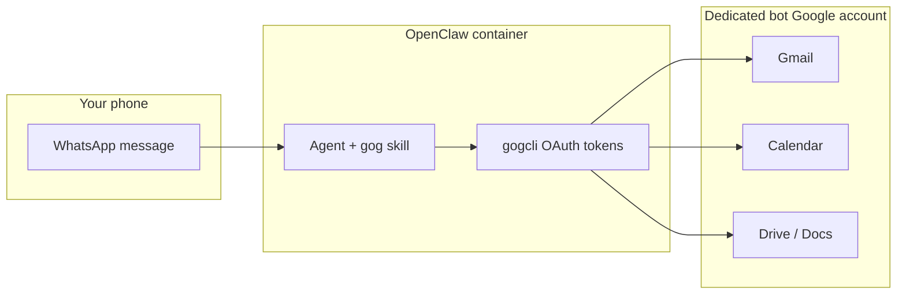

# Google Workspace setup

Connect Gmail, Calendar, Drive, and Docs so you can message the assistant on WhatsApp and say things like *"schedule lunch Tuesday"* or *"email Alex the invite."*

**Use a dedicated Google account for this bot — not your personal Gmail.**

---

## Why a dedicated email?

| Personal account | Dedicated bot account (`you-openclaw@gmail.com`) |
|---|---|
| Agent can read/send from your real inbox | Isolated inbox — only bot-related mail |
| OAuth token theft exposes everything | Blast radius is limited to the bot account |
| Mistakes send mail as *you* to contacts | Sends as the assistant — clearly separate |
| Calendar changes affect your real schedule | Bot calendar you share or sync selectively |
| Hard to revoke without breaking your life | Delete the account or revoke OAuth anytime |

**Recommended pattern:** create something like `yourname-openclaw@gmail.com`, use it for Google Cloud OAuth, and optionally [share specific calendars](https://support.google.com/calendar/answer/37082) from your personal account *into* the bot calendar (read/write as needed). That way the agent schedules on the bot calendar or a shared family calendar without owning your primary inbox.

> Do not store confidential mail, files, or primary-calendar events on the bot account. Treat it like a service account with a friendly name.

---

## Overview



---

## Step 1 — Create the bot Gmail account

1. Go to [accounts.google.com/signup](https://accounts.google.com/signup).
2. Create an address such as `yourname-openclaw@gmail.com`.
3. Complete verification (phone may be required).
4. **Do not** import personal contacts or link your primary Google account.
5. Add the address to `.env`:

   ```env
   GOG_ACCOUNT=yourname-openclaw@gmail.com
   GOG_KEYRING_PASSWORD=pick-a-long-random-string
   ```

`GOG_KEYRING_PASSWORD` encrypts stored OAuth tokens inside the container (required for headless/Docker).

---

## Step 2 — Google Cloud project (signed in as the bot account)

1. Open [console.cloud.google.com](https://console.cloud.google.com) **while logged in as the bot Gmail**.
2. **New project** → name it e.g. `openclaw-assistant`.
3. **APIs & Services → Library** — enable:
   - Gmail API
   - Google Calendar API
   - Google Drive API
   - Google Docs API
4. **APIs & Services → OAuth consent screen**
   - User type: **External** (fine for personal use)
   - App name: `OpenClaw Assistant`
   - Add your **personal email** as a test user (so you can approve consent during setup)
   - Scopes: add Gmail, Calendar, Drive as needed (start minimal; expand later)
5. **APIs & Services → Credentials → Create credentials → OAuth client ID**
   - Application type: **Desktop app**
   - Download JSON → save as `client_secret_….json`

---

## Step 3 — Install credentials in this repo

From the project root (container must **not** be running yet, or restart after):

```bash
make google-credentials SRC=/path/to/client_secret_….json
```

This copies the file to `data/google/credentials.json` (gitignored). Never commit it.

Verify:

```bash
make google-check
```

---

## Step 4 — Install the gog skill & authenticate

Gateway must be up (`make up`).

```bash
make google-setup    # check creds + install gog skill
make google-auth     # OAuth — see below
make google-status   # confirm connected
```

### OAuth in Docker (local Windows / Mac)

`make google-auth` runs `gog auth` inside the container. It prints a URL:

1. Copy the URL into your **host** browser (Chrome/Edge on your PC).
2. Sign in with **`GOG_ACCOUNT`** (the bot Gmail), not your personal account.
3. Approve the requested scopes.
4. If the redirect fails to reach the container, paste the full redirect URL from the browser address bar back into the terminal when prompted.

### OAuth on a remote/VPS host

Use an SSH tunnel so `localhost` redirects reach the container, or paste the redirect URL manually. See [DigitalOcean's OpenClaw + Google guide](https://www.digitalocean.com/community/tutorials/connect-google-to-openclaw) for tunnel details.

---

## Step 5 — Test from WhatsApp

With WhatsApp paired and the allowlist configured:

- *"What's on my calendar tomorrow?"*
- *"Send an email from the bot account to me@personal.com — subject Test, body Hello from OpenClaw"*
- *"Create a 30-minute event Friday at 2pm called Dentist"*

---

## Optional — Share your personal calendar with the bot

If you want the agent to see your real schedule without using your personal account for OAuth:

1. In **your personal** Google Calendar → Settings → share the calendar with `yourname-openclaw@gmail.com`.
2. Permission: **See all event details** (read) or **Make changes to events** (read/write).
3. The bot reads/writes that shared calendar via the dedicated account's OAuth.

This is the best of both worlds: personal account stays off the bot; the bot still sees what you want it to see.

---

## File layout

```
data/google/                    # mounted → /home/node/.config/gogcli
├── credentials.json            # OAuth client (from Google Cloud)
├── keyring/                    # encrypted tokens (auto-created)
└── …                           # gogcli state — all gitignored
```

---

## Troubleshooting

| Symptom | Fix |
|---|---|
| `Missing credentials.json` | `make google-credentials SRC=…` |
| Keyring passphrase prompt | Set `GOG_KEYRING_PASSWORD` in `.env`, restart container |
| `gog: command not found` | Run `make google-install` |
| OAuth redirect error | Use **Desktop app** credentials; paste redirect URL manually |
| Wrong inbox | Re-auth signed in as `GOG_ACCOUNT`, not personal Gmail |
| Calendar empty | Enable Calendar API; re-run `make google-auth` |
| Token expired | `make google-auth` again or `gog auth list` inside container |

---

## Revoking access

- Google Account → **Security → Third-party access** → remove the OpenClaw app
- Or delete `data/google/keyring/` and re-auth
- Nuclear option: delete the bot Gmail account
