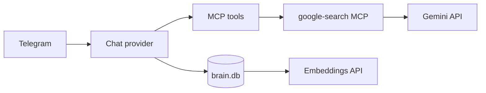

# Models (chat, search, embeddings)

Tim uses **three** model-ish surfaces. Only the first is “which brain answers Telegram.”

| Surface | What it does | Default today | Swappable? |
|---|---|---|---|
| **Chat** (`agents.main.model_provider`) | Replies, tool planning | Gemini `gemini-3.5-flash` | Yes — Gemini family or xAI/Grok |
| **Web search MCP** | Gemini Grounding + Google Search | Same `GEMINI_API_KEY` / `GEMINI_MODEL` | Needs a Gemini key (see [web-search.md](web-search.md)) |
| **Memory embeddings** | Hybrid SQLite vector recall | `gemini-embedding-001` | Separate from chat; still Gemini in this stack |

Upstream provider docs: [ZeroClaw providers](https://github.com/zeroclaw-labs/zeroclaw/blob/master/docs/book/src/providers/overview.md).

---

## Quick map



Changing **chat** does not automatically change search or embeddings.

---

## Gemini (default)

### Env

```env
GEMINI_API_KEY=...          # required today (chat + search + embeddings)
GEMINI_MODEL=gemini-3.5-flash
```

`make sync-config` writes `GEMINI_MODEL` into:

```toml
[providers.models.gemini.default]
model = "gemini-3.5-flash"
```

Compose injects the API key:

```text
ZEROCLAW_providers__models__gemini__default__api_key
ZEROCLAW_providers__models__gemini__default__model
```

Agent points at Gemini:

```toml
[agents.main]
model_provider = "gemini.default"
```

### Common Gemini chat IDs

| Model id | Role |
|---|---|
| `gemini-3.5-flash` | **Default** — cheap / fast for tool-heavy Telegram |
| `gemini-3.5-pro` | More depth when Flash is too thin |

Confirm current ids in [Google AI Studio](https://aistudio.google.com/) / Gemini API docs — Google renames often.

### Switch Gemini model only

1. Set `GEMINI_MODEL=...` in `.env`
2. Apply:

```bash
make sync-config
make remote-sync && make remote-restart
# local: make sync-config && make restart
```

Search MCP also reads `GEMINI_MODEL` from the container env (same value). If you want a cheap chat model but a different search model, that needs a compose split — not wired yet.

---

## xAI / Grok (chat swap)

ZeroClaw supports xAI as an OpenAI-compatible provider. **Chat can move to Grok while Gemini stays for search + embeddings.**

Get a key: [console.x.ai](https://console.x.ai/) → API keys.

### Suggested chat models

Check live ids/pricing: [xAI models](https://docs.x.ai/developers/models). Names change; prefer what the console lists today.

| Model id (examples) | Notes |
|---|---|
| `grok-4.3` | Solid general-purpose default for Tim-sized agent loops |
| `grok-4.5` | Higher capability / cost when you want more depth |
| `grok-build-0.1` | Coding-oriented; usually overkill for Telegram+MCP |

Retired slugs often **redirect** and bill at the new model’s rate — pin a current id, don’t assume an old “cheap” name stays cheap.

### Config changes (chat → Grok)

**1. `.env`**

```env
XAI_API_KEY=xai-...
XAI_MODEL=grok-4.3

# Keep Gemini for search + embeddings (still required in this stack)
GEMINI_API_KEY=...
GEMINI_MODEL=gemini-3.5-flash
```

**2. `config/config.toml.example`** (then `make sync-config`)

Add / keep an xAI alias and point the agent at it:

```toml
[providers.models.xai.default]
model = "grok-4.3"
# api_key from compose env — do not commit secrets

[providers.models.gemini.default]
model = "gemini-3.5-flash"
# still used indirectly if you leave search/embeddings on Gemini

[agents.main]
model_provider = "xai.default"
```

**3. `docker-compose.yml` environment**

```yaml
ZEROCLAW_providers__models__xai__default__api_key: ${XAI_API_KEY:-}
ZEROCLAW_providers__models__xai__default__model: ${XAI_MODEL:-grok-4.3}
# keep existing GEMINI_* / OPENAI_API_KEY=GEMINI_API_KEY for search + embeddings
```

If ZeroClaw’s `xai` family needs an explicit URI on your image version:

```toml
[providers.models.xai.default]
uri = "https://api.x.ai/v1"
model = "grok-4.3"
```

**4. Deploy**

```bash
make sync-config
make remote-sync && make remote-up
# or local: make sync-config && make up
```

**5. Verify**

Ask Tim something trivial, then check logs for the provider/model (`make remote-logs`). Dashboard health / traces should show `xai` (or the model id), not `gemini-3.5-flash`, for chat turns.

### Switch back to Gemini chat

1. Set `agents.main.model_provider = "gemini.default"` again
2. Redeploy (`make sync-config` + restart/up)
3. You can leave `XAI_API_KEY` in `.env` unused

---

## What does *not* move with chat

| Piece | Stays on |
|---|---|
| [Google Search MCP](web-search.md) | Gemini (`GEMINI_API_KEY`) |
| Hybrid memory embeddings | Gemini `gemini-embedding-001` via OpenAI-compatible URL in `config.toml` |
| Google Workspace / Strava / Garmin / Cast / YT Music MCPs | No LLM of their own — they are tools the **chat** model calls |

Full “no Gemini key at all” means replacing search + embeddings, not only `model_provider`.

---

## Cost notes

- Tim’s Telegram profile keeps **large** context (history pruning up to ~128k tokens, fat MCP schemas). Cheap-per-token still adds up on tool-heavy turns.
- Flash vs Pro (Gemini) and 4.3 vs 4.5 (Grok) is usually a bigger bill lever than shaving a few cents on the sticker price.
- Compare current rates yourself:
  - [Gemini API pricing](https://ai.google.dev/pricing)
  - [xAI models / pricing](https://docs.x.ai/developers/models)

---

## Safety / identity (any model)

Cheaper models do **not** remove hallucination risk. Tim’s hybrid memory can **auto-save** invented facts (including wrong emails). After any provider swap:

1. Prefer pinning real identity in `USER_GOOGLE_EMAIL` / workspace auth — don’t let the model invent it.
2. Use Telegram `/new` if a session went weird.
3. Treat long-term memory as untrusted until you’ve audited it.

---

## Checklist

**Gemini model bump only**

- [ ] `GEMINI_MODEL` in `.env`
- [ ] `make sync-config` + restart/deploy

**Chat → Grok**

- [ ] `XAI_API_KEY` (+ optional `XAI_MODEL`) in `.env`
- [ ] `[providers.models.xai.default]` in config
- [ ] `agents.main.model_provider = "xai.default"`
- [ ] Compose env for xAI api_key/model
- [ ] Keep `GEMINI_API_KEY` for search + embeddings
- [ ] Deploy and confirm chat model in logs
