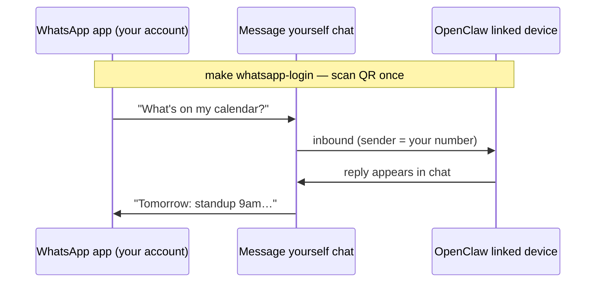
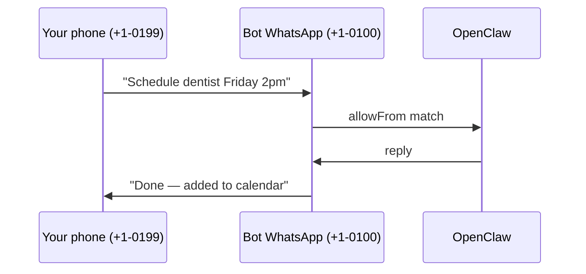

# WhatsApp setup

OpenClaw connects to WhatsApp like **WhatsApp Web** — a **linked device** on a WhatsApp account. No SMS. No Twilio. Just the WhatsApp app on your phone and a QR scan.

> **Not** WhatsApp “Channels” (broadcast feeds in the app). OpenClaw uses the normal chat / linked-device API.

---

## Pick a setup path

| Path | Second number? | Setup time | Best for |
|---|---|---|---|
| **[A — Message yourself](#path-a-message-yourself-easiest)** | No | ~5 min | Solo use, trying it out |
| **[B — Second WhatsApp number](#path-b-second-number-recommended)** | Yes | ~15 min + SIM | Cleaner identity, safer long-term |
| **[C — Telegram](#path-c-telegram-no-whatsapp)** | No | ~5 min | No WhatsApp at all |

**SMS / Twilio is not used** in this repo today — optional future channel only. Everything below is WhatsApp-in-the-app or Telegram.

---

## Path A: Message yourself (easiest)

Use **your existing WhatsApp account**. OpenClaw links as a linked device (same as WhatsApp Web on a laptop). You talk to the assistant in WhatsApp’s **Message yourself** chat — no second phone number.



### Steps

1. In `.env`, set **`WHATSAPP_ALLOW_FROM`** to **your** mobile number (E.164):

   ```env
   WHATSAPP_ENABLED=true
   WHATSAPP_ALLOW_FROM=+15551234567
   ```

2. `make sync-config` (or `make up`, which runs sync automatically).

3. `make whatsapp-login` — QR code in the terminal.

4. On **your phone**: **Settings → Linked devices → Link a device** → scan.

5. Open WhatsApp → **Message yourself** (or “Note to self”) → send a test message.

6. Only numbers in `WHATSAPP_ALLOW_FROM` can command the bot. Everyone else’s messages to your account are ignored.

### Trade-offs

| Pros | Cons |
|---|---|
| No second SIM | Replies come **from your account** (same profile/name) |
| One phone | Misconfiguration of allowlist = higher risk |
| Fastest path | Linked-device session in `data/` = full account access if leaked |
| | Don’t use for untrusted groups until you trust the agent |

**Good for:** personal assistant, solo testing, calendar/email/flights from your own chat thread.

---

## Path B: Second number (recommended long-term)

Two **roles**:

| Role | Number | Purpose |
|---|---|---|
| Bot identity | `+1-555-0100` (prepaid / eSIM) | OpenClaw logs in as this WhatsApp account |
| You | `+1-555-0199` (your daily phone) | In `WHATSAPP_ALLOW_FROM`; you text the **bot number** |

You do **not** need a second phone forever — only a second **number** to register WhatsApp once. After `make whatsapp-login`, the SIM can sit in a drawer; session lives in `data/`.



Ways to get a bot number without a second daily phone:

- Prepaid SIM / cheap eSIM (~$5–10/mo)
- WhatsApp **second account** on the same phone (needs second number)
- Old phone on Wi‑Fi for one-time registration + QR scan

---

## Path C: Telegram (no WhatsApp)

If WhatsApp isn’t worth the hassle:

```bash
make up
make shell
# inside container — create a bot via @BotFather, then:
node dist/index.js channels add --channel telegram --token "<BOT_TOKEN>"
```

No QR, no phone number politics. OpenClaw docs cover Telegram well.

---

## What `make whatsapp-login` does

1. OpenClaw prints a QR code (terminal or Control UI).
2. You scan from **Settings → Linked devices → Link a device**.
3. Session persists under `data/` until WhatsApp revokes it or you log out linked devices.

Re-run if the bot stops replying.

---

## Config reference

| `.env` | Purpose |
|---|---|
| `WHATSAPP_ENABLED` | `true` / `false` — synced to `openclaw.json` |
| `WHATSAPP_ALLOW_FROM` | Comma-separated E.164 numbers allowed to **command** the bot |

After editing `.env`:

```bash
make sync-config
make restart
```

---

## SMS / Twilio

**Not implemented.** The `.env.example` SMS variables are placeholders for a possible future channel. You do **not** need them for WhatsApp. Ignore unless we add Twilio to the roadmap.

---

## Troubleshooting

| Symptom | Fix |
|---|---|
| QR won’t scan | Terminal too small — widen window; or use Control UI |
| No reply in Message yourself | Check `WHATSAPP_ALLOW_FROM` matches your number exactly (E.164, `+` prefix) |
| “Unauthorized sender” | `make sync-config`; verify `data/openclaw.json` → `channels.whatsapp.allowFrom` |
| Bot replies to everyone | allowlist empty or wrong — fix `.env` and sync |
| Session died | WhatsApp → Linked devices → remove old session; `make whatsapp-login` |
| Want to disable WhatsApp | `WHATSAPP_ENABLED=false` in `.env`, `make sync-config`, `make restart` |

---

## Security reminders

- **Path A:** your personal account is the bot — keep `allowFrom` tight (only your number).
- **Path B:** bot account is isolated; your personal chats stay separate.
- **`data/`** holds the linked-device session — treat like a password; don’t sync to cloud backup unencrypted.
